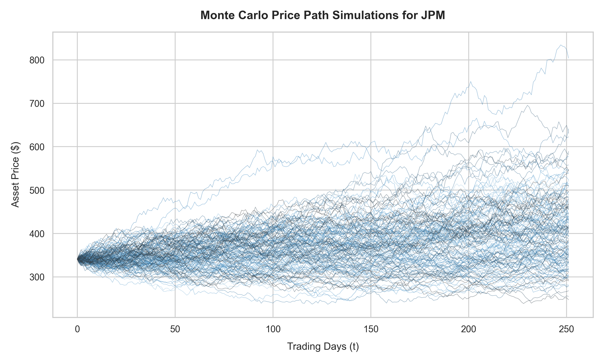

# Quantitative Risk Analysis: Monte Carlo Value at Risk (VaR) Engine

This repository contains a modular quantitative risk management engine implemented in Python. The tool simulates future asset price pathways based on stochastic calculus frameworks to extract accurate downside capital risk metrics under volatile market conditions.

## 1. Methodological Framework

The simulation engine models asset price dynamics using **Geometric Brownian Motion (GBM)**. The discrete price trajectories are generated via the analytical solution integrated through **Itô's Lemma**:

$$S_t = S_0 \exp\left(\left(\mu - \frac{1}{2}\sigma^2\right)t + \sigma W_t\right)$$

*   **$S_0$**: Starting baseline asset price.
*   **$\mu$**: Historical drift coefficient (average asset daily return).
*   **$\sigma$**: Asset volatility parameter (daily return standard deviation).
*   **$\frac{1}{2}\sigma^2$**: Volatility drag correction adjusting for geometric compounding variance.
*   **$W_t$**: Wiener Process generating continuous standard normal stochastic shocks.

---

## 2. Prerequisites & Core Libraries

Before executing the simulation models, ensure that your environment is provisioned with Python along with the following mandatory data science and quantitative engineering packages:

*   **`yfinance`**: Open-source interface utilized to pull historical time-series market data directly from Yahoo Finance.
*   **`numpy`**: High-performance multidimensional array architecture for vectorized mathematical arrays and random walk paths.
*   **`pandas`**: Data structures designed for robust time-series data alignment, cleaning, and log return manipulations.
*   **`matplotlib` & `seaborn`**: Visualization libraries configured to output publication-quality statistical distributions and pathway trajectories.
*   **`pillow`**: Image processing library used as the compiling engine to synthesize separate simulation frames into a live `.gif` asset trace.

---

## 3. Analytical Outputs & Risk Metrics

### A. Stochastic Price Trajectories Evolution
The engine models independent random walks to observe potential terminal boundary outcomes. Below is a structural mapping of the simulated asset pathways over a 252-trading-day horizon.

> **Note:** A dynamic animated `.gif` version of these trajectories can be rendered locally by executing the dedicated animation cell within the `VaR_monte_carlo.ipynb` notebook.


### B. Empirical Value at Risk (VaR) Performance
The output execution summary highlights the parametric downside boundary extracted from $10,000$ simulated iterations:

```text
==============================================================
          MONTE CARLO VaR FOR JPMORGAN CHASE CO.   
==============================================================
Initial Asset Price (S0)   : $341.10
Simulation Horizon         : 252 Trading Days (1 Year)
VaR 95% Confidence Level   : -16.59%
Parametric Exposure Loss   : $1,658.73 (Per $10,000 Portfolio)
==============================================================
```

### C. Financial Interpretation of the Output
*   **Downside Risk Capital Boundary:** At a 95% confidence level, the maximum expected capital erosion for JPMorgan Chase & Co. (JPM) over a 252-trading-day horizon is **16.59%**. This means we are 95% statistically confident that the maximum loss will not exceed this threshold under normal market conditions.
*   **Tail Risk Domain (The 5% Exception):** Conversely, there is a structural 5% probability (representing extreme tail events or systemic market shocks) that the annual portfolio loss could exceed 16.59%. In institutional risk management, this tail region requires further stress testing and Expected Shortfall (ES) mapping to capture non-linear black swan risks.
*   **Absolute Portfolio Capital Allocation:** For an institutional baseline position of **$10,000**, the absolute maximum dollar exposure at risk (Dollar VaR) is precisely **$1,658.73**. This metric directly dictates the required economic capital buffers and regulatory reserves under Basel framework guidelines to prevent insolvency during adverse market cycles.
